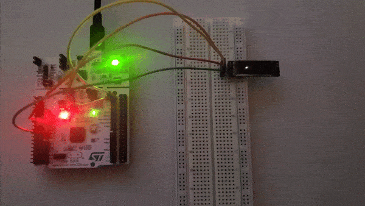

# Bare-metal STM32 SSD1306 Driver (I2C)

A custom bare-metal driver for the SSD1306 OLED display, interfaced via I2C with an STM32 microcontroller. Both the driver and the accompanying example program are written from scratch, without relying on any high-level libraries or HAL (Hardware Abstraction Layer).

### Hardware used:
- MCU: [STM32F401RE](https://www.st.com/en/microcontrollers-microprocessors/stm32f401re.html)
- Platform: [Nucleo-64 ](https://www.st.com/en/evaluation-tools/nucleo-f401re.html)
- SSD1306 OLED Screen (128x32)

(Note: memory layout is specific to stm32f401re MCU)

### Requirements
- ARM GCC, https://launchpad.net/gcc-arm-embedded - ARM GCC toolchain (Cross compiler/Linker)
- ST link, https://github.com/stlink-org/stlink - ST link tool for command line flashing of MCU

Add these tools to the Path (Windows)

### Building
```
git clone https://github.com/htiaGG/stm32-game-loader-SSD1306.git
cd stm32-game-loader-SSD1306
.\build.bat
```
Currently the batch file builds and flashes (enable in build.bat) the MCU, so make sure the board is connected (through STLINK).

### Demo

